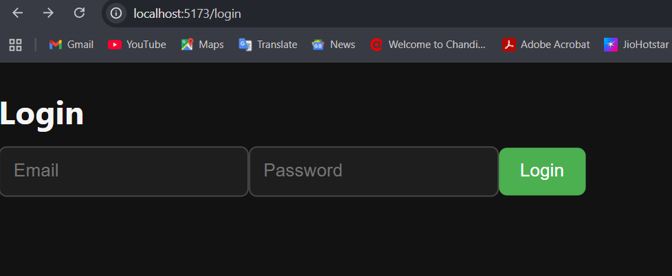
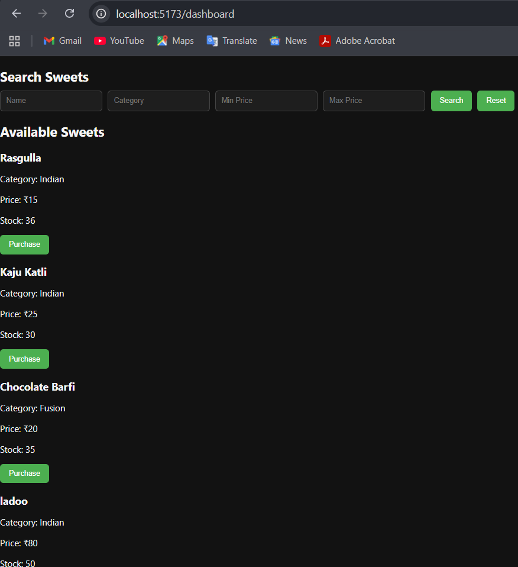
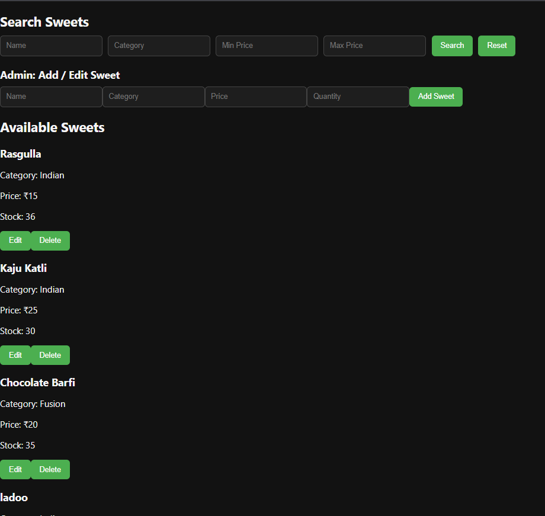

# Sweet Shop Management System

A full-stack Sweet Shop Management System that allows users to browse and purchase sweets, and admins to manage inventory with add, edit, delete, restock, and search functionality.

This project is built as part of a technical assessment with a strong focus on:
- Clean code
- REST API design
- Test-Driven Development (TDD)
- Role-based access (Admin / User)

## Features

### User
- Login authentication
- View available sweets
- Search sweets by:
  - Name
  - Category
  - Minimum price
  - Maximum price
- Purchase sweets (disabled when out of stock)

### Admin
- Login with admin role
- Add new sweets
- Edit existing sweets
- Delete sweets
- Restock sweets
- View full inventory

### System
- Role-based UI rendering
- Inventory validation
- RESTful APIs
- Full backend test coverage using Jest & Supertest


## Tech Stack

### Frontend
- React (Vite)
- Axios
- CSS (Dark UI)

### Backend
- Node.js
- Express.js
- TypeScript
- Prisma ORM
- SQLite

### Testing
- Jest
- Supertest

### Tools
- Git & GitHub
- VS Code


## Screenshots

### Login Page


### User Dashboard


### Search Sweets


### Admin Dashboard


### Admin Add / Edit Sweet


## Setup & Run Instructions

### Prerequisites
- Node.js (v18+ recommended)
- npm

### Clone Repository
```bash
git clone https://github.com/student-palak/sweet-shop-management-system.git
cd sweet-shop-management-system


cd backend
npm install
npx prisma migrate dev
npm run dev

http://localhost:3000

cd frontend
npm install
npm run dev
http://localhost:5173


---

## 📌 6️⃣ Running Tests (TEST REPORT)

This is **mandatory** and you already have passing tests 🎉

```md
## Running Tests

All backend APIs are tested using Jest and Supertest.

### Run Tests
```bash
cd backend
npm test


---

## 📌 7️⃣ My AI Usage (MANDATORY – YOU DID THIS RIGHT)

You already have this, but **final polished version** 👇  
Replace your current section with this if you want it stronger:

```md
## My AI Usage

I used ChatGPT as an AI assistant during development to:

- Clarify assessment requirements
- Design REST API structure
- Generate initial test case templates following TDD
- Debug issues related to Prisma, Jest, and Supertest
- Validate REST API best practices

### How AI Helped My Workflow
AI helped speed up development and catch errors early.  
All core logic, architectural decisions, test validations, and final implementations were written, reviewed, and fully understood by me.

I used AI as a productivity and learning aid — not as a replacement for problem-solving.

